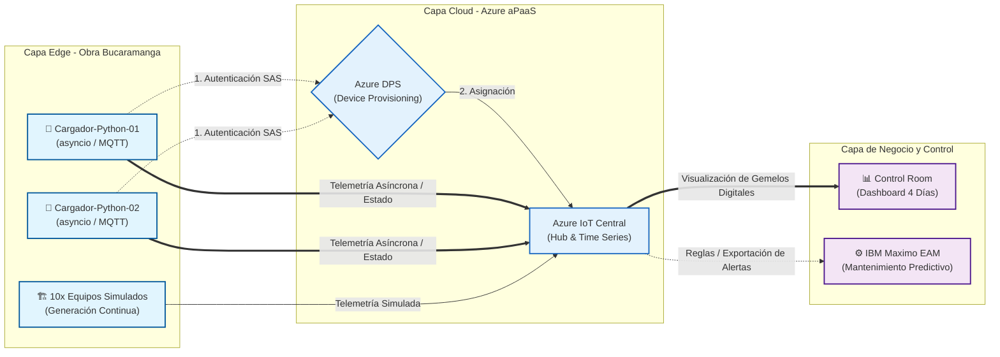
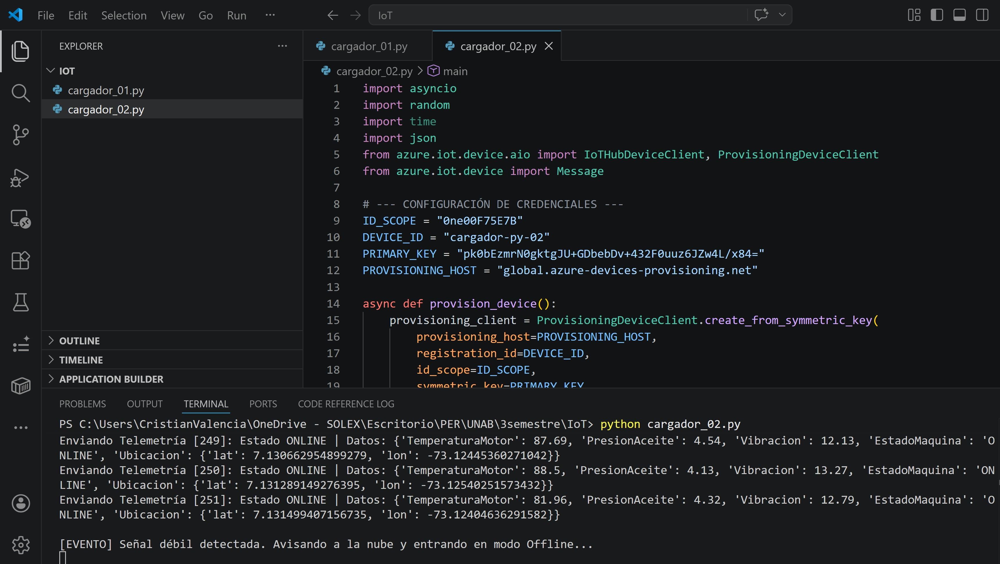
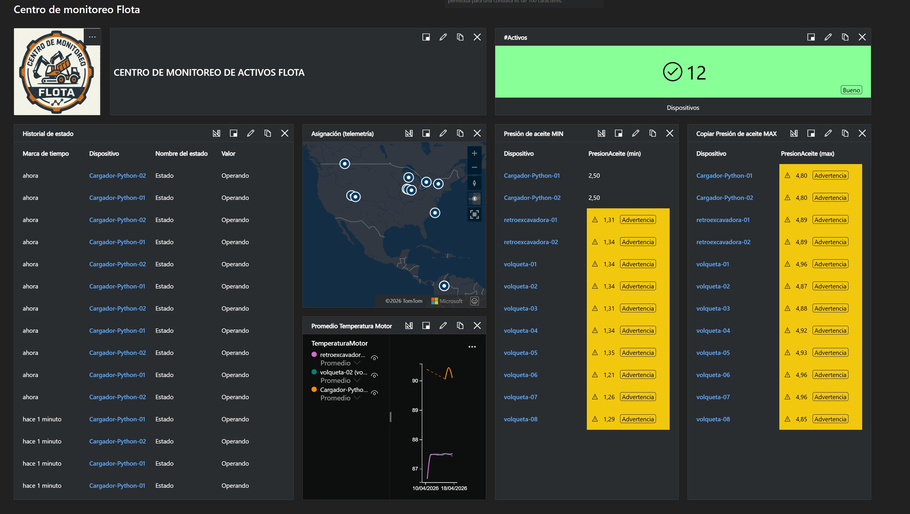
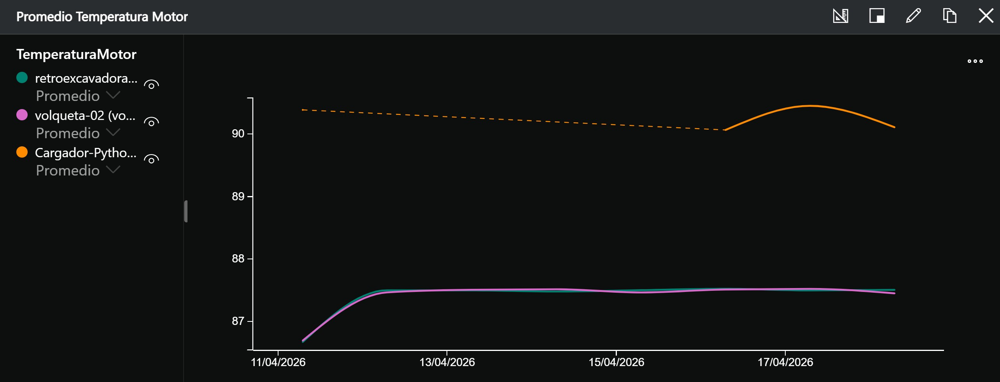
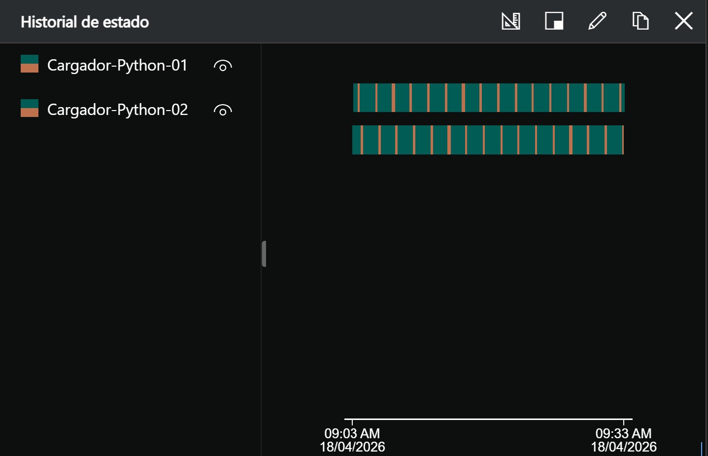

# TallerIOT
Taller práctico IOT Central
_______________________________________________

# Centro de Monitoreo y Mantenimiento Predictivo para Flota de Maquinaria Pesada

**Desarrollador:** Cristian Valencia  
**Plataforma Cloud:** Azure IoT Central & Azure Static Web Apps  

---

## 1. Arquitectura de la Solución

Se diseñó e implementó una arquitectura de Internet de las Cosas (IoT) orientada a la monitorización de 12 activos críticos (maquinaria amarilla). El objetivo es recopilar telemetría de los motores y sistemas hidráulicos para alimentar modelos de mantenimiento predictivo.

* **Infraestructura Cloud:** Azure IoT Central (aPaaS) plan Standard 1.
* **Aprovisionamiento de Seguridad:** Device Provisioning Service (DPS) mediante tokens SAS.
* **Composición de la Flota:**
    * 10 Dispositivos Simulados (Retroexcavadoras y Volquetas) generando datos base de forma continua.
    * 2 Dispositivos Edge Reales (Cargadores Frontales) operando mediante scripts asíncronos en Python.

---

## 2. Especificaciones de Hardware y Gemelos Digitales (Digital Twins)

Se construyó la plantilla `Maquinaria_Pesada_Template` utilizando el lenguaje de definición DTDL. A continuación, se presenta la tabla comparativa de las variables monitoreadas, parametrizadas según las hojas de datos (datasheets) de instrumentación industrial real para garantizar la coherencia del gemelo digital.

| Variable (Semántica) | Sensor Físico de Referencia | Rango de Operación | Límites en IoT Central (Mín - Máx) |
| :--- | :--- | :--- | :--- |
| **Temperatura Motor** | RTD PT100 (Danfoss MBT 5250) | -50°C a +200°C | 70°C – 105°C |
| **Presión Aceite** | Transmisor Piezoresistivo (WIKA A-10) | 0 a 10 Bar | 1.2 Bar – 5.0 Bar |
| **Vibración Hidráulica**| Acelerómetro Industrial (Hansford HS-100)| 0 a 50 mm/s | 0.0 mm/s – 25.0 mm/s |
| **Ubicación** | Módulo GNSS (u-blox NEO-M8N) | N/A | Variable (Geocerca: Obra Bucaramanga) |
| **EstadoMáquina** | Metadato de Red/Hardware | ONLINE / OFFLINE | N/A (Diccionario de Estado) |

---

## 3. Lógica de Borde (Edge Computing) y Asincronía

Para cumplir con los requerimientos de asincronía y simulación de pérdida de red en entornos industriales hostiles, se implementó un cliente en Python para los dispositivos reales.

**Características Técnicas de la Implementación:**
1.  **Asincronía No Bloqueante:** Uso de la librería `asyncio` para garantizar que la recolección local de datos no se detenga mientras se espera confirmación de red.
2.  **Protocolo de "Apagado Elegante" (Graceful Disconnect):** El activo envía explícitamente el estado `OFFLINE` a la variable de telemetría `EstadoMaquina` justo antes de cortar la conexión de red, previniendo falsas alarmas por falla catastrófica del hardware.
3.  **Generación de Carga Controlada:** Los datos se generan respetando estrictamente los límites operativos definidos en la tabla de instrumentación.

*Figura 1: Consola Edge (Gateway) enviando telemetría asíncrona y reportando estado de señal débil.*

---

## 4. Cuarto de Control (Dashboard) y Validación de Datos

El diseño del panel de control se estructuró como una herramienta de soporte a la toma de decisiones (DSS), validando información operativa durante una ventana de **4 días no continuos**.

*Figura 2: Centro de monitoreo integral con rastro geoespacial, recuento de flota (12 activos) y límites operativos.*

### 4.1 Comparativa de Variables
Se contrastó el comportamiento de un activo real frente a un modelo simulado, evidenciando el seguimiento de los límites operativos a lo largo del tiempo.

*Figura 3: Comparativa de Temperatura de Motor en ventana de 4 días (Simulado vs. Real).*

### 4.2 Validación de Asincronía y Estado
La gestión del ciclo de vida de la conexión y las desconexiones asíncronas se reflejan en el seguimiento de estado del dispositivo Edge, garantizando la trazabilidad de la disponibilidad operativa.

*Figura 4: Historial evidenciando los ciclos de operación (ONLINE) y los eventos de pérdida de red controlada (OFFLINE).*
